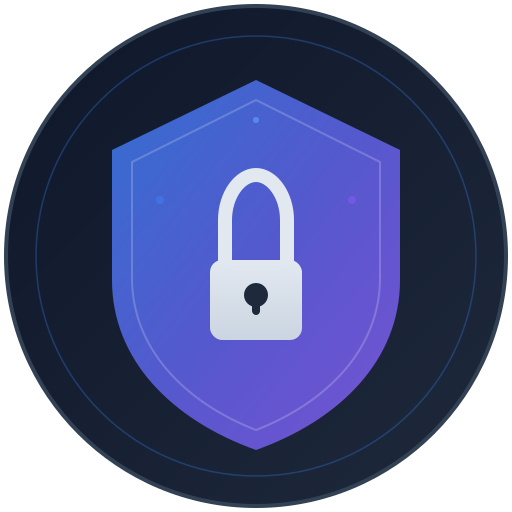

<p align="center">
  
</p>

<h1 align="center">SecureVault</h1>

<p align="center">
  <strong>Encrypted File Storage & Secure Notes</strong><br>
  <em>تخزين ملفات مشفرة وملاحظات آمنة</em>
</p>

<p align="center">
  
  
  
  
  
</p>

---

## About | نبذة عن التطبيق

**SecureVault** is a cross-platform desktop application for securely storing encrypted files and private notes. Built with military-grade **AES-256-GCM** encryption and **Argon2id** key derivation, your data stays protected behind a single master password.

**SecureVault** هو تطبيق سطح مكتب متعدد المنصات لتخزين الملفات المشفرة والملاحظات الخاصة بشكل آمن. مبني بتشفير **AES-256-GCM** واشتقاق مفاتيح **Argon2id**، بياناتك محمية بكلمة مرور رئيسية واحدة.

---

## Features | المميزات

| Feature | الميزة |
|---------|--------|
| AES-256-GCM file encryption | تشفير الملفات بـ AES-256-GCM |
| Secure notes with encrypted content | ملاحظات آمنة بمحتوى مشفر |
| Master password with Argon2id hashing | كلمة مرور رئيسية مع تجزئة Argon2id |
| Arabic & English interface | واجهة عربية وإنجليزية |
| RTL layout support | دعم التخطيط من اليمين لليسار |
| Dark theme | سمة داكنة |
| Offline — no internet required | يعمل بدون إنترنت |
| Cross-platform (Linux, Windows, macOS) | متعدد المنصات |

---

## Tech Stack | التقنيات المستخدمة

| Layer | Technology |
|-------|-----------|
| **Framework** | [Tauri 2.0](https://v2.tauri.app/) |
| **Frontend** | React 19 + TypeScript |
| **Backend** | Rust |
| **Encryption** | AES-256-GCM + Argon2id |
| **Database** | SQLite (rusqlite) |
| **Styling** | TailwindCSS v4 |
| **State** | Zustand |
| **i18n** | react-i18next |
| **Build Tool** | Vite 7 |

---

## Screenshots | لقطات الشاشة

> _Coming soon..._

---

## Getting Started | البدء

### Prerequisites | المتطلبات

- **Node.js** >= 18
- **Rust** (stable toolchain)
- **System dependencies** (Linux):
  ```bash
  sudo apt install libwebkit2gtk-4.1-dev build-essential libssl-dev libayatana-appindicator3-dev librsvg2-dev
  ```

### Installation | التثبيت

```bash
# Clone the repository
git clone https://github.com/alielastal/SecureVault.git
cd SecureVault

# Install dependencies
npm install

# Run in development mode
npm run tauri dev

# Build for production
npm run tauri build
```

---

## Project Structure | هيكل المشروع

```
SecureVault/
├── src/                    # React Frontend
│   ├── components/         # UI components (Sidebar, Layout)
│   ├── features/           # Feature modules
│   │   ├── auth/           # Master password & dashboard
│   │   ├── files/          # Encrypted file management
│   │   └── notes/          # Secure notes editor
│   ├── i18n/               # Arabic & English translations
│   ├── stores/             # Zustand state management
│   └── lib/                # Tauri IPC wrappers
│
├── src-tauri/              # Rust Backend
│   └── src/
│       ├── commands/       # Tauri IPC commands
│       ├── services/       # Crypto, Database, Storage
│       └── models/         # Data structures
```

---

## How It Works | كيف يعمل

1. **Setup** — Create a master password on first launch
2. **Unlock** — Enter your master password to access the vault
3. **Encrypt Files** — Upload any file to encrypt and store it securely
4. **Secure Notes** — Write private notes that are encrypted at rest
5. **Decrypt** — Access your files and notes anytime with your master password

```
Master Password → Argon2id → 256-bit Key → AES-256-GCM → Encrypted Data
```

---

## Security | الأمان

- **AES-256-GCM** — Authenticated encryption with unique nonce per item
- **Argon2id** — Memory-hard password hashing resistant to GPU/ASIC attacks
- **No cloud** — All data stays on your device
- **No telemetry** — Zero data collection

---

## License | الرخصة

This project is licensed under the MIT License.

---

<p align="center">
  Made with Rust & React
</p>
